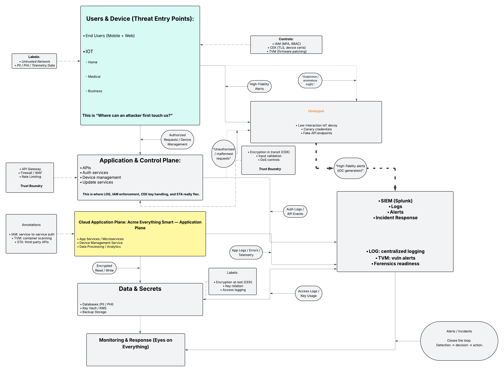

# Cloud Security Requirements & Threat Modeling

## Project Summary
Acme Everything Smart, Inc. builds smart devices for homes, businesses, and the medical world. These devices aren’t just gadgets, they handle some of the most sensitive data out there: personal details (PII), medical records (PHI), financial info, and device telemetry. To keep all of this safe, every device connects into Acme Everything Smart (ES) platform, a SaaS solution running on Microsoft Azure’s commercial cloud.

The SE platform is locked down with multi-factor authentication (MFA) for both admins and customers, and it works with outside identity providers when needed. Encryption follows FIPS 140-2 standards for data both moving and stored. All logs feed into Splunk Cloud SIEM, giving TRex visibility for monitoring and investigations. Updates are handled automatically through secure APIs, and because reliability is life-or-death for medical devices, they run on Verizon ISP for critical connections.

Dataflows in the environment include customers talking to devices, devices pushing back into ES, and management-plane activity feeding the application plane. Smart devices pull in things like biometrics or environmental stats, send them over encrypted tunnels, and trigger real-time analytics. That might mean nudging a user with advice, or in the case of a medical emergency, automatically dialing 911. Authorized users (Viewers) can see results when policy allows, while Acme Everything Smart admins manage the bigger picture, continuous monitoring, patching, and encryption key management.

This report focuses on five areas of the Cloud Controls Matrix (CCM) that matter most to Acme Everything SMart right now: Identity & Access Management (IAM), Logging & Monitoring (LOG), Threat & Vulnerability Management (TVM), Supply Chain Management (STA), and Cryptography, Encryption & Key Management (CEK). Each section breaks down where Acme ES stands today and gives direct recommendations on how to tighten the organization’s defenses at the policy, operations, and technical levels.
  
2 System Diagram
Refer to this System Diagram.
The system diagram shows how the Acme ES platform runs on Microsoft Azure’s commercial cloud. On one side you’ve got the application plane, where the smart devices plug in and talk with SE services. On the other side sits the management plane, where admins keep control of updates, monitoring, and security.
The diagram also maps the main dataflows:
- Customers connecting to their devices through their ISP
- Devices sending data back into the SE platform over encrypted tunnels
- Management-plane activity feeding into the application plane to keep everything patched and running smooth
ES services are the heart of the platform. This is where the analytics, alerts, and automation happen, from running health checks on medical devices to sending out recommendations or triggering an emergency call when needed.
The system also layers on boundary protections, which are like digital walls and gates that keep untrusted traffic out and only allow approved communication in. These defenses keep attackers from slipping through open doors.
Every login is backed by multi-factor authentication (MFA), meaning nobody gets in with just a password. Users confirm their identity with something extra (like a phone app or token). MFA matters because it blocks the easy wins for attackers, like stolen passwords.
For encryption, Acme ES relies on FIPS 140-2 validated cryptography, the federal gold standard for protecting sensitive data in motion and at rest. This ensures customer data, from heart rate stats to login credentials, stays private end-to-end. Some experts now lean toward faster, modern algorithms like ED25519, which can offer strong security with better performance for signing and key exchange. But FIPS 140-2 remains the compliance baseline and makes sure Acme ES is meeting industry and government standards.
All of these guardrails, boundary protections, MFA, and encryption, work together to lock down confidentiality, integrity, and availability across the environment.

## Threat Model
## Threat Model Architecture

This architecture diagram illustrates the threat entry points, trust boundaries, control layers, and monitoring flow for the Acme Everything Smart SaaS IoT platform. It demonstrates how identity, encryption, vulnerability management, logging, and optional deception techniques work together to detect, contain, and respond to threats across the cloud application lifecycle.

### Primary Risks
### Threat Actors
### Assumptions

## Environment Setup
### Cloud Platform Assumptions
### Identity & Access
### Threat-to-Control Mapping (CCM-Aligned)

The following table illustrates how identified threats were mapped to Cloud Controls Matrix (CCM) domains and corresponding security controls within the architecture:

| Threat Scenario              | CCM Domain | Control Focus                                   | Architectural Tie-In |
|-----------------------------|------------|--------------------------------------------------|----------------------|
| Identity misuse / account takeover | IAM        | MFA enforcement, RBAC, least privilege           | Identity provider, access logs, auth services |
| API abuse & unauthorized access   | APP        | API gateway validation, rate limiting, authZ     | Application & Control Plane |
| Data exfiltration risk            | CEK / LOG  | Encryption at rest & in transit, audit logging   | Data & Secrets layer, SIEM |
| Delayed threat detection          | LOG        | Centralized logging, alerting, IOC generation    | Monitoring & Response layer |

### Logging & Monitoring

## Implementation & Analysis
(How you mapped risks → CCM controls)

## How to Run This Yourself
1. Review architecture assumptions
2. Identify assets and trust boundaries
3. Map threats to CCM control families
4. Document gaps and recommendations

## Results & Evidence
This is not about logs or screenshots (unless you want to add them later).

It’s about outcomes:

High-risk areas identified (identity misuse, API abuse, data exfil)

Gaps acknowledged (no real SIEM integration, conceptual tooling)

Security posture: defense-in-depth with monitoring maturity

### Key Findings

The threat modeling exercise produced the following insights:

- **Identity is the primary attack surface**  
  Most high-impact threat paths originate from credential misuse or authorization gaps, reinforcing IAM as the core control plane.

- **API exposure represents a critical trust boundary**  
  Improper input validation or insufficient rate limiting would enable abuse scenarios directly impacting availability and data integrity.

- **Detection maturity outpaces prevention depth**  
  Centralized logging and alerting are well-positioned to detect anomalies, but some preventive controls (e.g., real SIEM integration) remain conceptual.

- **Deception techniques provide early-warning value**  
  The optional honeypot layer offers low-noise indicators and improves adversary visibility without expanding the primary attack surface.

These findings directly map to the architecture diagram, particularly the identity boundary, application control plane, and monitoring layers where validation, logging, and alerting controls were evaluated.

## Executive Summary
The platform assumes hostile networks by default

Identity is the primary control plane

Visibility closes the loop between prevention and response

Architecture favors detection and containment over perfection

## Tools Used
- Cloud Controls Matrix (CCM)
- Azure (assumed)
- SIEM (Splunk – conceptual)
- Identity Provider (Okta – conceptual)

Threat identification and control mapping in this project align with CSA CCM domains and NIST SP 800-series guidance, informed by ATT&CK threat behaviors and OWASP risk patterns.

## References

- Cloud Security Alliance. (2021). *Cloud Controls Matrix (CCM) v4*.  
  https://cloudsecurityalliance.org/research/cloud-controls-matrix

- National Institute of Standards and Technology. (2020).  
  *Security and Privacy Controls for Information Systems and Organizations (SP 800-53 Rev. 5).*  
  https://doi.org/10.6028/NIST.SP.800-53r5

- National Institute of Standards and Technology. (2018).  
  *Framework for Improving Critical Infrastructure Cybersecurity (NIST CSF).*  
  https://www.nist.gov/cyberframework

- MITRE Corporation. (2023).  
  *MITRE ATT&CK® Framework.*  
  https://attack.mitre.org/

- OWASP Foundation. (2021).  
  *OWASP Top 10 Web Application Security Risks.*  
  https://owasp.org/www-project-top-ten/

## Closing Note

This project demonstrates a security-first mindset grounded in practical threat modeling and control mapping. While Acme Everything Smart is fictional, the risks, controls, and architectural patterns reflect real-world cloud security challenges faced by modern SaaS and IoT platforms.

- Cloud Security Alliance – CCM
- NIST SP 800-series
